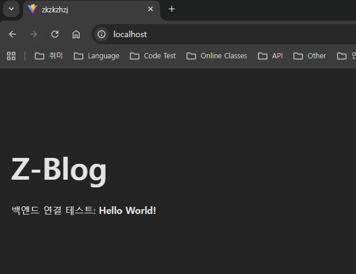

# 📅 2026년 02월 1주차 업무 목표

## 🎯 핵심 목표 (High-Level)
> * 매주 토요일 Workflow-Week Time 에 점검할 목표 설정
- [ ] 

## 🛠 상세 태스크 (Technical Tasks)
> * 목표를 이루기 위한 구체적인 작업 정의
- [ ] 

## 🧪 시행착오 (Trials)
> * 경험했던 시행착오 정리
- **[상황] → [원인] → [해결/교훈]** 
> 로컬 빌드를 하였지만 Entity 를 읽어서 테이블 생성이 이루어지지 않음 -> ddl-auto: update 구문 들여쓰기 이슈 -> 들여쓰기를 맞추어 주어 옳바르게 읽을 수 있게 지정 / 처음에는 Entity 를 못읽어오는 이슈인줄알고 잘못된 부분을 확인하고 Error 로그만 찾는 시간을 보내서 시간을 많이 버림. 빌드 결과물은 target 하위를 보아서 확인, Error 로그 뿐만아니라 다른 로그도 꼼꼼히보자

> build 파일을 생성해서 리눅스서버에 올리고 실행하였으나 에러 발생 -> application 설정 지정 및 enc 파일 부재로 인하여 읽어오지 못하는 에러 -> 운영환경에 맞게 설정 파일 업로드 및 실행 명령어 수정으로 해결 / 추후에 github action 으로 자동 처리할 때 환경설정을 어떯게 동기화할지 고민해보자

## 📝 주말 회고 (Retrospective)
- 잘된 점
> 프로젝트 기본 세팅 및 로컬 리눅스 서버 빌드 성공, 테이블 생성

- 아쉬운 점
> 생각보다 기본 로컬에 올리는 것 자체에서 애먹은 부분이 많아서 아쉬웠다.
> 
> 기본 설정에서도 놓치는 부분이 많았고 아직까지 이해를 다하지못한 상태에서 설정한 값들도 있으니 한번 되돌아보자
> 
> 회고 작성도 뭔가 일기처럼 작성했는데.. 이런식이 아닐것 같아 개발자의 글쓰기 도서를 가볍게 읽어보자

- 다음 주에 이어서 할 것
> 실제 소스 개발을 진행하며 웹 페이지에서 게시글을 볼 수 있게 하자

---

## 일일 회고

### 📅 2026-02-02 (Day 1)
* **하루 리뷰**
> 오늘은 커넥트 웨이브 탈락 후 다시 마음을 다잡고 의자에 앉은 날
> 
> 오랜만에 연락된 친구와 이야기를 해보고 내 방향성을 다잡을 수 있었다.
> 
> 근래에 스스로에 대한 반성과 방향성에 대해서 많은 고민의 시간을 거쳤고 크게 봤을 때 개발자의 길도 포기하려고 했었다..
> 
> 사실 나는 개인적인 공부는 제대로 해본적이 없다.
> 
> 핑계지만 회사일만 처리하기에도 정신이 없었고 전회사의 경우 주말 출근에 평일엔 11시에 집가는게 당연했으니까.. 또 퇴근하면 놀기 바빳으니까..
> 
> 친구와 많은 이야기를 하고 나 스스로도 이대로 안된다는 것을 절실히 깨달았고 내 방향을 제대로 잡기로 했다.
> 
> 팀 프로젝트를 경험해보면 좋겠다는 친구의 말에 지원을 넣었고 좋은 대답이 왔으면 좋겠다.
> 
> 친구와의 대화와 스스로의 마음을 다잡고 힘내자

### 📅 2026-02-03 (Day 2)
* **하루 리뷰**
> 자기반성식 일일 회고는 끝이다
> 
> 오늘은 어제 친구와의 대화를 곱씹으며 내가 앞으로 뭘준비해야할지 정리하는 시간과 일일회고를 작성해보는 시간을 가졌다.
> 
> 일단 이전에는 어떤 작업을 하던 바로 git push 를 했지만 이건 의미없는 잔디심기에 불과하다고 생각하여 회고는 토요일에 올리기로 정했다.
> 
> 또한, 기능의 경우에도 issue 생성 후 완성되면 올리자!
> 
> 오늘 생각해본 것들을 정리한다.
> #
> 단순하게 서버를 올린다 라는 개념에서 확장되어야한다.
> 
> 우선적으로 localhost 를 벗어나면 자연스럽게 http 도 벗어나야한다고 생각한다.
> 
> 지금 시대에 보안은 필수적이니 SSL 을 첫 번째로 생각했다.
> 
> 두 번째로 서버를 1개만 올리는 것이 아니라 최소 2개는 올려서 서버 하나에 문제가 생기더라도 유저 사용성이 무너지지 않게 하자.
> 
> 서버가 2대라면 추후에 생각하게될 무중단 배포도 생각할 수 있다.
> 
> 블루-그린, 롤링, 카나리 대표적으로 3개의 무중단 배포법이 있다고 하는데 추후에 생각해보자
> 
> 자, 그러면 여기서 또 의문이든다.
> 
> 서버가 2대라면 Web 서버에서 어떤 서버로 요청할지 어떻게 정의하고 구분할 수 있을까?
> 
> 거기서 필요한게 로드 밸런싱 이라는 기술이다.
> 
> nginx 를 통해서 서버 분산 처리를 통해 많은 트래픽이 몰리더라도 속도가 느려지지 않게 관리를 할 수 있다고 한다.
> 
> 그런데 여기서 끝이 아니였다.
> 
> 서버가 2대인 상태에서 만약 로그인 세션 또는 내 블로그에는 추후 채팅 기능을 넣고싶은데 그 채팅 이력 등 A서버에서 사용하다가 B서버로 연결된 유저는 어떻게 사용성을 유지할 수 있을까?
> 
> 거기서 추가적으로 찾게되는게 인메모리 데이터 관리를 해주는 레디스를 찾게 된다.
> 
> 이렇게 고민을 하다보니 지나가며 듣기만 하던 기술들이 왜 필요하고 찾게 되는지 알게되었다...
> 
> 여기서 데이터베이스도 메인 DB, 서브 DB 를 두어 관리하는 방법도 있다고 하는데 여기는 아직 배보다 배꼽이 크다고 생각하기 때문에 생각 까지만 해두었다.
> 
> 그리고 지금까지 고민해왔던 내용들이 합쳐지만 하나의 모놀리틱 아키텍처가 된다고 한다.
> 
> 그래서 여기서부터는 호기심에 추가적으로 찾아본 내용이다.
> 
> 모놀리틱 아키텍처의 장점도 있지만 회사 공고들을 많이 보다보면 나오는 MSA 아키텍처라는 게 있다.
> 
> 이걸 잠시 찾아본 나의 결론은 객체지향적 설계랑 매우 흡사하다고 생각했다.(이 생각이 맞는 생각인지는 모르겠지만..)
> 
> 하나의 전체 서버를 띄우는게 아닌 기능별 도메인별로 나누어 분리시켜 더많은 서버 라기보단 분산된 서버를 둔다.
> 
> 예전에 잠시 안드로이드 개발할 때 들었던 다중 모듈이랑 매우 흡사하다고 생각된다.
> 
> MSA 아키텍처를 제대로 설계하기 위해선 전체 분석과 더불어 어떤 기능들이 어느 서버(모듈)에 포함되어야 하는지 고민하는 게 중요할 것 같다.
> 
> 그래서 DDD 라는 개념, 도메인 주도 설계라는게 한창 입에서 떠올랐던 걸까?
> 
> 이렇게 고민을 하다보니 하루가 금방 가버렸다...
> 
> 너무 즐거웠다. 왜 이 즐거움을 이제 꺠달았을까
> 
> 지금은 정보를 습득하기에 편하기 때문에 즐거운걸까? 실제로 부딫혀보면 많은 난관이 있겠지만 달려보자
> 
> 당연히 위에 인프라 구성이라고 해야할 지 이런것도 중요하지만 자바도 차근차근 다시 보자
> 
> 객체지향 설계를 나도 한번 제대로 해보고 싶다.
> 
> 블로그 프로젝트 얼른 첫 오픈하고 다른 것들도 같이 해보고 싶다
> #
> 추가적으로 오늘 react 빌드 결과물을 WSL 리눅스 서버에 올려서 nginx 랑 연동해주었다.
> 
> 하지만 Entity 를 읽어와서 자동으로 테이블 생성 해주길 바랬지만 2가지 문제가 발생했다.
> 
> 첫 번째로 Entity 를 못읽어 오는 문제 그리고 ScanEntity 로 강제했을 때 Long Type 관련 에러가 발생한 것.
> 
> 이건 내일 해결해봐야겠다.
> 
> 위 내용과 별개로 nginx 쪽에 빌드된 dist 결과물을 매칭시켜주기 위해서 찾아봤다.
> 
> 그런데 var/www/html 쪽에 있는 기본 파일만 주구장창 읽어오길래 좀 찾아봤더니 아래와 같이 나왔다.
> 
> nginx 의 설정은 etc/nginx/nginx.conf 를 기본으로 읽어오는 것 같다.
> 
> 프로젝트 빌드 결과물 전용 conf 파일을 생성해주어서 etc/nginx/conf.d/내파일.conf 파일이 읽어올 수 있게 해주었고 재시작 하였다.
> 
> 하지만 될거라는 기대와 달리 여전이 기존에 읽어오던 html 을 읽어오는 것으로 확인했다.
> 
> 좀더 찾아보니... /etc/nginx/sites-enabled/default 여기를 기본으로 읽어오는데 여기 속성에 listen 80 default_server; 값이 있는데 이것 때문에 기본 값으로 읽어오는 것 같다.
> 
> 일단 default 파일의 경우 현재 필요없을 것으로 생각되어 백업을 따두었고 제거하니 정상적으로 나오지만 백엔드 연결부분이 어긋나서그런지 index.html 을 text 로 뿌려주고있다
> 
> 좋아 내일 봐야할 에러도 확실해졌고 nginx 도 단순하지가 않고 추후 설정할때 많이 파봐야겠다.

### 📅 2026-02-04 (Day 3)
* **하루 리뷰**
> 야근 및 개인 일정

### 📅 2026-02-05 (Day 4)
* **하루 리뷰**

##### Spring Entity 생성 이슈
> Entity 는 읽었지만 테이블 생성 안되는 오류 -> ddl-auto: update 동작하지 않는 이유는 들여쓰기 때문.. spring 하위에 jpa 설정이 들어가야 한다.
> 
> * 관련한 내용 -> https://docs.spring.io/spring-boot/appendix/application-properties/index.html
> 
> mysql 진입 명령어 -> mysql -u root -p (mysql 을 root 유저로 들어가며 password 입력)
> 
> 데이터베이스/테이블 확인 -> show *, 사용 -> use *
> 
> 테이블 생성확인 -> show create table *

#### nginx 서버 설정
> nginx.conf 파일 내부에 conf.d 폴더 하위를 include 하게 되어있다.
>
> conf.d 내부 커스텀 conf 파일 생성하여 사용
>
> server 설정
> * 80 포트로 왔을때 보내줄 서버 경로로 z-blog 폴더 index.html 바라보게 설정
> * location /*/ 설정을 추가하여 spring 서버 바라보도록 지정(추후에 이설정으로 라우팅 하게될까?)

#### Spring 서버 설정
> jar 위치
> * opt 폴더 하위 존재
>   * 리눅스 에서 opt 폴더는 추가 에플리케이션 관리를 위한 폴더
>   * 참고 - https://refspecs.linuxfoundation.org/FHS_3.0/fhs/ch03s13.html
> 
> jar 를 컴퓨터 실행시 마다 자동으로 실행하게 service 추가
> * /etc/systemd/system 하위에 service 추가 - 부팅 시 서비스 실행(TODO : 추후 더 상세하게 보자)

#### 사용한 리눅스 명령어
> cd * -> 이동 명령어 / cd .. -> 상위 디렉토리 이동
> 
> cp 복사할파일위치 복사할위치 -> 복사
> 
> mv 파일명 변경할파일명 -> cp + rm 기능
> 
> jar위치 -jar *.jar -> 자바 jar 실행

#### 마무리
> 오늘은 Entity 를 읽어서 자동으로 테이블 생성되게 하며 빌드 결과물들을 내 리눅스 서버에 올려보았다.
> 
> localhost 입력하여 잘 열리는 것을 확인했지만 아.. spring 에서 application.yml local 만 세팅되어있어서 못읽어오네...
> 
> 저거까지만 해결하면 실 코딩에 들어갈 수 있다!! 한번 확인해보자
> 
> 그리고 nginx 에 대한 사용법도 공부하면 좋을 것 같다.
> 
> 내가 했던 방식으로 로드 밸런싱 처리나 리버스 프록시?.. 처리를 하지는 않을탠데
> 
> 추후에 SSL 도 넣어야하고 개념도 공부한번 주말에 정리하자
> 
> 늦었다고 포기하는 것 보다 조금씩이라도 나아가자

### 📅 2026-02-06 (Day 5)
* **하루 리뷰**

#### 커피챗
> 스스로의 성장, 그리고 개발자의 길에 대한 확신, 프로젝트 시작과 끝을 경험하기 위해서 프로젝트 형식의 과외 커피챗을 진행했다.
> 
> 멘토분들과 많은 이야기를 했고 너무나 갚진 시간이였다.
> 
> 첫 번째로 나의 부정적인 생각들을 버릴 수 있게 되었다.
> 
> 두 번째로 내가 가고자 하는 방향이 틀리지 않다 라는 생각을 가지게 되었다.
> 
> 마지막으로 내가 되고자 하는 목적지에 대해서 다시 생각해볼 수 있었다.

#### 야근
> 토요일 운영반영이 있어서 회사에서 야근 후 운동하고나니 커피챗 시간에 가깝더라..
> 
> 그래서 개인공부는 하지 못했지만 공부인증 형식의 스터디에 가입했다.
> 
> 다들 좋은 분들인 것 같았고 하루에 1시간씩은 꼭 CS 공부 또는 코테 준비를 하기로 마음먹었다.

### 📅 2026-02-07 (Day 6)
* **하루 리뷰**

#### 주말출근
> 운영반영을 하고 퇴근을 하니 17시가 되었고 운동을 다녀오니 평일 퇴근시간이 되버렸네
> 
> 그래도 반영이 잘되어서 다행이다

#### spring build error
> React Build 결과물을 nginx 에서 location 등록해서 80 포트로 접근시 보이도록 설정하여 localhost 에서 내 페이지를 확인했다.
> 
> api 도메인으로 동일하게 location 을 주었으나 502 bad request 가 응답되길래 확인해보니 application.yml 을 못읽어주더라
> 
> 당연한걸 놓치고 있었다
> 
> 현재 intellij 에서 실행히 ACTIVE=local 로 해두었고 application.yml 도 local 만 존재한다.
> 
> proc yml 생성해주고 빌드 결과물을 포함해주었고 당연하게도 실행 스크립트에 proc 으로 실행될 수 있게 설정해주었다.
> 
